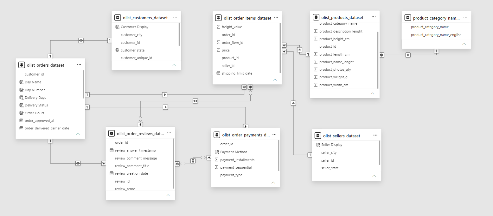
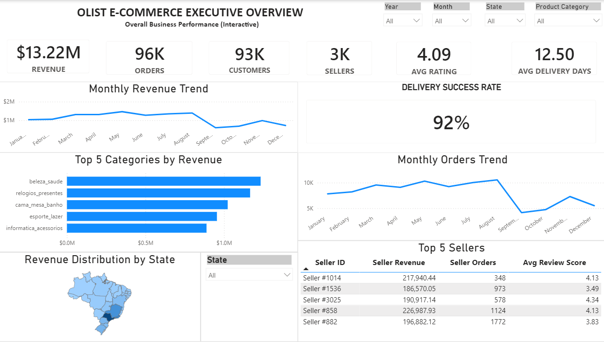
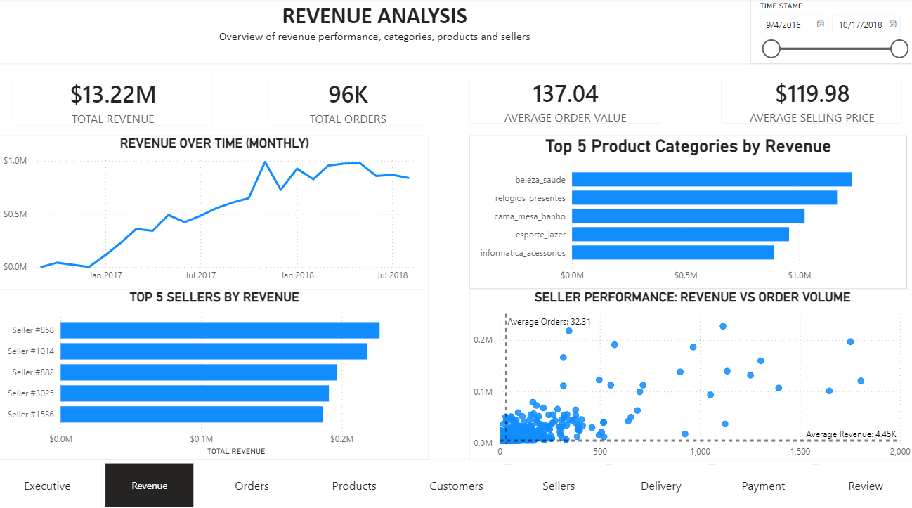
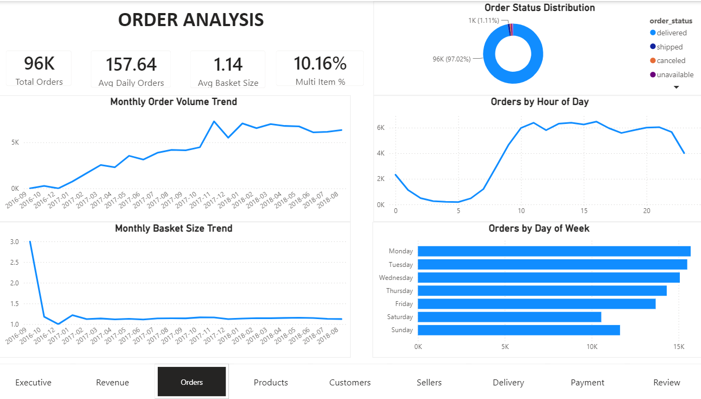
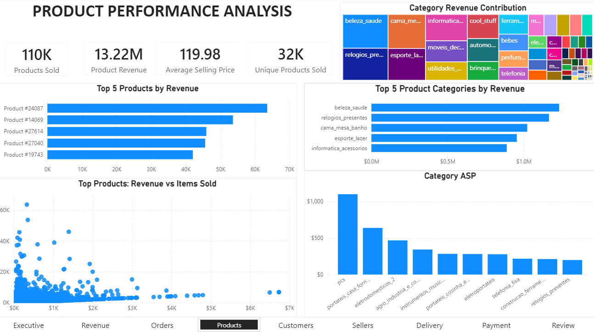
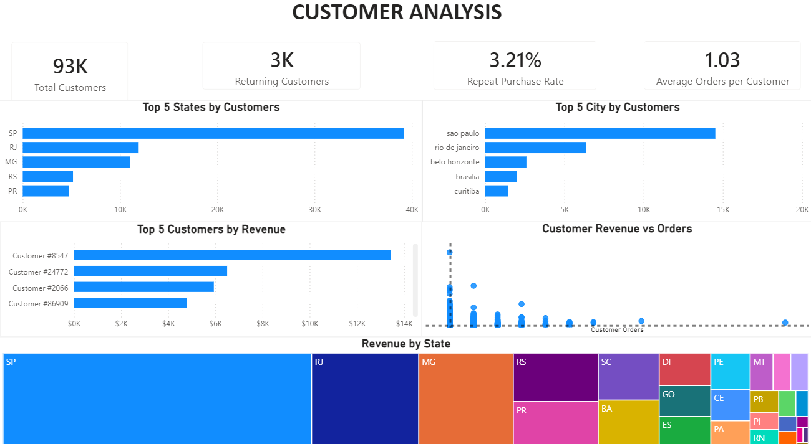
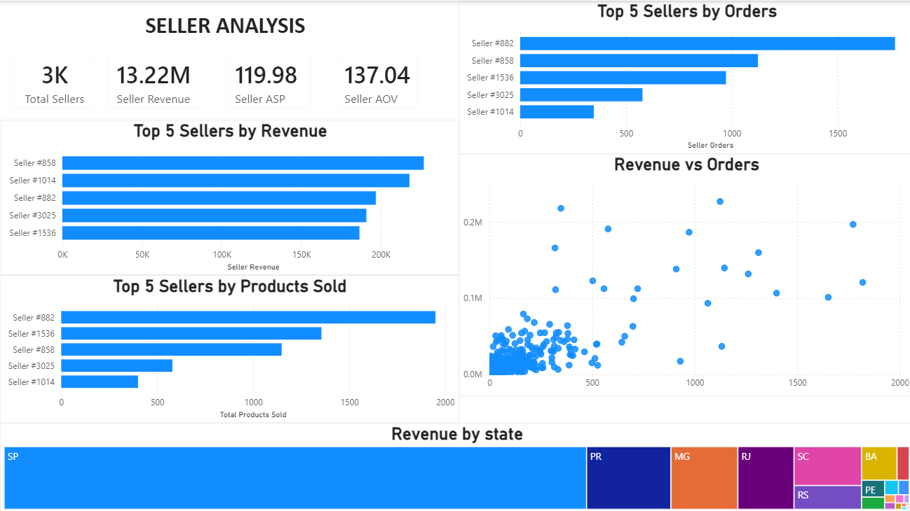
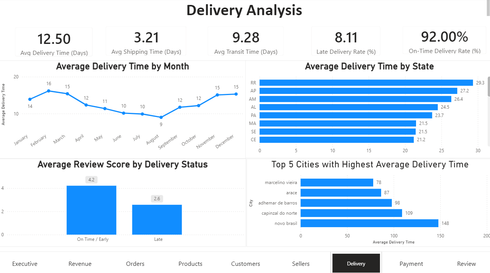
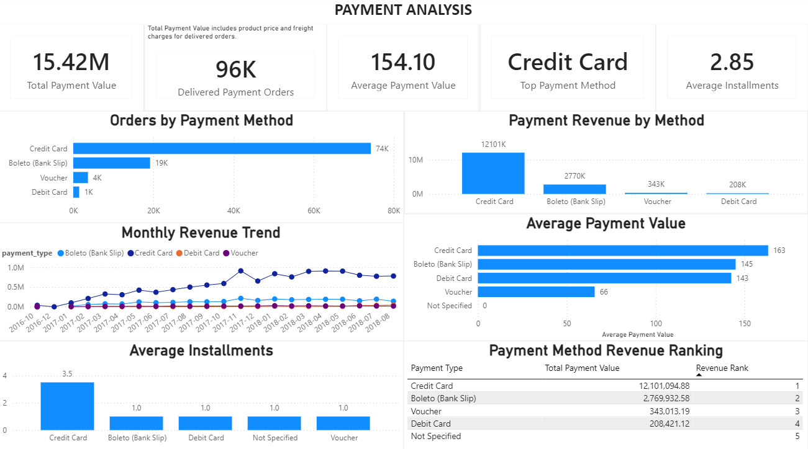

# Olist E-commerce Business intelligence Dashboard Project

> An end-to-end Business Intelligence project built using the Olist Brazilian E-commerce Dataset to analyze sales, customers, products, sellers, delivery performance, payments, and customer reviews through SQL and Power BI.

---

# Table of Contents

- [Project Overview](#project-overview)
- [Business Problem](#business-problem)
- [Business Objectives](#business-objectives)
- [Dataset](#dataset)
- [Technology Stack](#technology-stack)
- [Data Model](#data-model)
- [ETL Process](#etl-process)
- [SQL Analysis](#sql-analysis)
- [Dashboard Overview](#dashboard-overview)
- [Dashboard Screenshots](#dashboard-screenshots)
- [Key Business Insights](#key-business-insights)
- [Business Recommendations](#business-recommendations)
- [Skills Demonstrated](#skills-demonstrated)
- [Repository Structure](#repository-structure)
- [Future Improvements](#future-improvements)

- ---

# Project Overview

This project presents an end-to-end Business Intelligence solution built using the **Olist Brazilian E-commerce Dataset**. The objective was to transform raw transactional data into meaningful business insights through data cleaning, modeling, analysis, and interactive visualization.

The dashboard enables stakeholders to monitor key business metrics, evaluate operational performance, and identify opportunities across multiple areas of the business, including revenue, orders, products, customers, sellers, delivery performance, payment methods, and customer reviews.

The solution was developed by combining SQL for data analysis, Power Query for data transformation, DAX for KPI calculations, and Power BI for interactive dashboard development.
---

# Business Problem

E-commerce businesses generate large volumes of transactional data every day. However, without proper analysis, it is difficult to identify sales trends, monitor operational performance, understand customer behavior, and make informed business decisions.

The objective of this project was to transform raw e-commerce data into an interactive Business Intelligence solution that enables stakeholders to monitor key performance indicators (KPIs), evaluate business performance, and identify opportunities for improvement across different business functions.
---

# Business Objectives

The project was designed to answer key business questions, including:

- How is revenue changing over time?
- Which product categories generate the highest revenue?
- Which Brazilian states contribute the highest revenue?
- What are the most common payment methods?
- Which sellers generate the highest revenue?
- How efficiently are orders delivered?
- How satisfied are customers based on review scores?
- Which business metrics should executives monitor regularly?

---

# Dataset

This project uses the **Olist Brazilian E-commerce Public Dataset**, which contains information on customer orders placed through the Olist marketplace in Brazil.

The dataset includes multiple related tables covering:

- Customers
- Orders
- Order Items
- Products
- Sellers
- Payments
- Reviews
- Geolocation
- Product Category Translation

The relational structure of the dataset makes it suitable for end-to-end Business Intelligence projects involving data modeling, SQL analysis, KPI development, and dashboard creation.

---

# Technology Stack

| Category | Tools Used |
|----------|------------|
| Database | PostgreSQL |
| Query Language | SQL |
| Data Visualization | Power BI Desktop |
| Data Transformation | Power Query |
| KPI Development | DAX |
| Data Modeling | Power BI Relationships |
| Dataset | Olist Brazilian E-commerce Dataset |

## Dataset

This project uses the **Olist Brazilian E-commerce Public Dataset**, which contains real-world e-commerce data including customers, orders, products, sellers, payments, reviews, and delivery information.

**Dataset Source:**  
https://www.kaggle.com/datasets/olistbr/brazilian-ecommerce

### Tables Used

- customers
- orders
- order_items
- products
- sellers
- payments
- reviews
- category_translation

#  Data Model

The dashboard is built on a relational data model using the Olist Brazilian E-commerce Dataset. The model connects orders, customers, order items, products, sellers, payments, reviews, and product category tables through primary and foreign key relationships.
This data model enables accurate KPI calculations, efficient filtering, and interactive analysis across multiple business areas, including revenue, orders, products, customers, sellers, delivery, payments, and customer reviews.

## ETL Process

The dashboard follows a complete ETL (Extract, Transform, Load) workflow before analysis.

### Extract
- Imported multiple Olist CSV datasets into PostgreSQL.
- Connected Power BI to PostgreSQL for data retrieval.

### Transform
- Cleaned missing values.
- Corrected data types.
- Created calculated columns for delivery days, delivery status, order hour, weekday, and customer/seller display fields.
- Translated Portuguese product categories into English.
- Removed unnecessary columns and optimized the model.

### Load
- Built a star-schema style data model in Power BI.
- Created relationships between orders, customers, products, sellers, payments, reviews, and categories.
- Developed DAX measures and KPIs for interactive dashboard reporting.

# Dashboard Overview

The Power BI dashboard consists of **9 interactive report pages**, each focusing on a different business area of the Olist Brazilian E-commerce marketplace.

| Dashboard | Description |
|------------|-------------|
| Executive Overview | High-level business KPIs including revenue, orders, customers, sellers, ratings, and delivery performance. |
| Revenue Analysis | Revenue trends, top product categories, seller performance, and revenue distribution. |
| Order Analysis | Order volume, basket size, order status, hourly and weekly order trends. |
| Product Analysis | Product performance, category contribution, average selling price, and top-selling products. |
| Customer Analysis | Customer distribution, repeat purchase rate, customer revenue, and geographic insights. |
| Seller Analysis | Seller revenue, orders, products sold, and seller performance comparison. |
| Delivery Analysis | Delivery time, shipping performance, late deliveries, and delivery efficiency by state and city. |
| Payment Analysis | Payment methods, payment value, installments, and payment trends. |
| Review Analysis | Customer ratings, review trends, satisfaction analysis, and review score distribution. |

# Dashboard Screenshots
## 1. Executive Dashboard

Provides a high-level overview of the business with key KPIs including revenue, orders, customers, sellers, ratings, and delivery performance.

  
  

## 2. Revenue Analysis

Analyzes revenue performance across time, product categories, and sellers. This dashboard highlights monthly revenue trends, top-performing categories, leading sellers, and the relationship between seller revenue and order volume.

  
  

## 3. Order Analysis

Provides insights into order patterns, order status distribution, purchase behavior, and order trends over time. This dashboard helps evaluate customer purchasing activity and overall order performance.

  
  

## 4. Product Analysis

Explores product and category performance by analyzing sales, revenue, average selling price, and product popularity. This dashboard identifies top-performing products and categories to support inventory and merchandising decisions.

  
  

## 5. Customer Analysis

Examines customer behavior, geographic distribution, purchasing patterns, and customer contribution to revenue. This dashboard provides insights into customer segments and helps identify opportunities to improve customer retention and business growth.

  
  

## 6. Seller Analysis

Evaluates seller performance by comparing revenue, order volume, product sales, and seller contribution across the marketplace. This dashboard helps identify top-performing sellers and supports performance benchmarking.

  
  

## 7. Delivery Analysis

Analyzes shipping performance, delivery timelines, and fulfillment efficiency. This dashboard highlights delivery delays, average delivery time, and geographic shipping performance to identify opportunities for operational improvement.

  
  

## 8. Payment Analysis

Provides insights into customer payment behavior by analyzing payment methods, installment usage, payment values, and transaction trends. This dashboard helps understand purchasing preferences and supports financial decision-making.

  
  

## 9. Review Analysis

Analyzes customer feedback and satisfaction by examining review scores, review trends, and rating distributions. This dashboard helps evaluate customer experience, identify service quality issues, and uncover opportunities to improve customer satisfaction.

  
  

# SQL Analysis
This project uses PostgreSQL to perform business analysis on the Olist Brazilian E-commerce dataset. SQL was used to clean, transform, aggregate, and analyze the data before building the Power BI dashboard.
The analysis focuses on answering real-world business questions related to sales performance, customer behavior, product performance, seller efficiency, delivery operations, payments, and customer reviews.

# Key Business Insights

[#key-business-insights](#key-business-insights)

- **Revenue and scale:** The platform processed $13.22M in revenue across 99,441 orders (96,478 delivered) from 96,096 unique customers and 3,095 sellers between late 2016 and August 2018.

- **Geographic concentration is extreme.** São Paulo (SP) alone accounts for 38.3% of total revenue ($5.07M), more than the next four states combined (Rio de Janeiro, Minas Gerais, Rio Grande do Sul, and Paraná). Revenue is not distributed evenly across Brazil — it is a São Paulo–driven marketplace.

- **Health & beauty is the leading category, but not by a wide margin.** health_beauty generated $1.26M (9.3% of item revenue), narrowly ahead of watches_gifts ($1.21M) and bed_bath_table ($1.04M). The top five categories are closely clustered rather than dominated by one clear leader.

- **Delivery performance is solid but not uniform.** Average delivery time is 12.5 days with a 92.1% on-time rate — meaning roughly 7,800 orders arrived late. Delivery reliability is a measurable minority-but-material risk, not a rare exception.

- **Customer satisfaction is polarized, not uniformly high.** While the average review score is 4.09/5, the distribution is bimodal: 57.8% of reviews are 5-star, but 11.5% are 1-star — nearly four times the 2-star rate. A high average masks a meaningful unhappy-customer segment.

- **Credit card dominates payment behavior.** 73.9% of transactions use credit card, representing 78% of total payment value, with an average of 2.85 installments per order — indicating heavy reliance on installment-based purchasing common in the Brazilian market.

- **Data completeness note:** The dataset contains no order records after August 2018 — the apparent revenue decline in September–October reflects the end of data collection, not a real business trend.

---

# Business Recommendations

[#business-recommendations](#business-recommendations)

- **Investigate the 1-star review segment specifically**, rather than relying on the average rating. With 11.5% of reviews at 1-star against a healthy 4.09 average, aggregate satisfaction metrics are hiding a meaningful churn-risk group; root-causing this segment (late deliveries, product mismatch, seller-specific issues) would likely yield more actionable fixes than optimizing for the average.

- **Reduce geographic dependency on São Paulo.** With 38.3% of revenue concentrated in one state, targeted marketing or seller-onboarding investment in the next-largest markets (Rio de Janeiro, Minas Gerais) could diversify revenue and reduce exposure to regional disruption.

- **Prioritize delivery reliability improvements**, since the 7.9% late-delivery rate is a plausible contributor to the 1-star review cluster; cross-referencing late deliveries against review scores would confirm or rule out this link before allocating logistics spend.

- **Support installment-based payment options as a retention lever**, given credit card's 73.9% share and near-3-installment average — this reflects real purchasing behavior in the Brazilian market rather than a preference to be optimized away.
